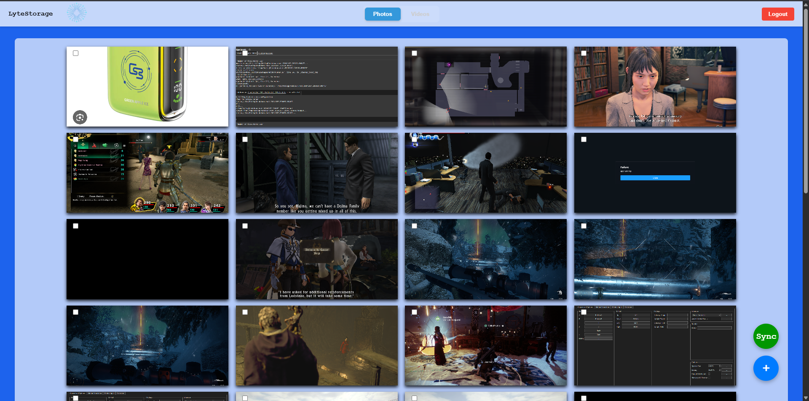
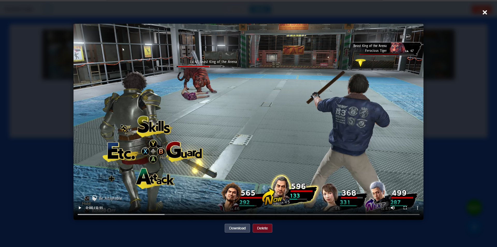

<h1 align="center">LyteStorage</h1>

<div align="center">

</div>

<h3 align="center"><b>Light-weight self-hosted photo storage management system - Specialized for low RAM usage and stability</b></h3>

# Installation Instructions

The follow details the installation process for all systems. Windows, Mac and Linux

## Docker Desktop

Docker Desktop is required to self host.

<a href="https://www.docker.com/products/docker-desktop/">Docker Desktop Link</a>

## App

Download a zip of the repo from the release section

or

clone the repo if you want the cutting edge. *disclaimer: may be buggy

```terminal
https://github.com/hodge-py/LyteStorage.git
```

Open the terminal and navigate to the folder containing the repo

```terminal
docker compose build --no-cache
```

```terminal
docker compose up -d
```

As easy as that

An .env file will need to be included in the root of the folder and will be used to set the database credentials

```shell
MYSQL_ROOT_PASSWORD=root_password
MYSQL_DATABASE=my_database
MYSQL_USER=my_user
MYSQL_PASSWORD=my_password
PMA_HOST=db
MYSQL_ROOT=root
PORT=80
```

Change these to your own custom values

To access the site simply type in the local IP address of the device hosting

IP Commands:

Windows:

```terminal
ipconfig
```

Linux:

```terminal
ip addr show
```

or

```terminal
ipconfig
```

IP address may be available in the settings of your operating system

To shutdown the app run:

```terminal
docker compose down
```

# Performance

Idle performance of LyteStorage on radxa rock 3c rk3566 with 2GB of RAM.

<div align="">

</div>

# RoadMap

### In no particular order

* Main App
  * Image Searching
  * Location Mapping
  * Improve Performance
  * Other file types
  * GUI to start the app
  * Thumbnail Optimization
* Desktop
  * Add desktop API for easy syncing
  * Automatic syncing
* Android/IOS
  * App for automatic syncing

# Gallery




